# WavePilot

[](https://github.com/Jimmy-Xi/wavepilot/actions/workflows/ci.yml)
[](LICENSE)
[](pyproject.toml)

**An adaptive acoustic OFDM modem with synchronization, soft-decision FEC, real-passband WAV transport and explainable link adaptation.**

WavePilot turns arbitrary bytes into a synchronized OFDM frame, passes it through deterministic wireless/acoustic impairments, and reconstructs the original payload with CRC verification. The same frame can be upconverted to a mono 48 kHz PCM WAV at a 12 kHz carrier and decoded back into a file.

This is an end-to-end communications system rather than a BER plotting notebook: the receiver must discover the frame, estimate carrier-frequency offset, estimate and equalize the channel, track pilot phase, soft-demodulate QAM, run a Viterbi decoder and validate the recovered file.

## Why it is portfolio-grade

- **Complete synchronization path:** repeated-half preamble, normalized matched-filter detection and CFO estimation/correction.
- **Real frame design:** training symbol, two robust QPSK headers, payload length/MCS/CRC metadata, pilots and cyclic prefixes.
- **Three MCS levels:** Gray-coded QPSK, 16QAM and 64QAM with max-log soft LLRs.
- **Forward error correction:** rate-1/2, constraint-length-7 convolutional code with terminated soft-decision Viterbi decoding.
- **Channel estimation:** known long-training symbol, one-tap frequency-domain equalization and per-symbol pilot phase tracking.
- **Audio transport:** complex baseband to 12 kHz real passband, 16-bit PCM WAV export, offline downconversion and low-pass recovery.
- **Explainable adaptation:** BLER target, EWMA SNR/BLER and hysteresis choose the highest defensible MCS without a black-box model.
- **Measurable outputs:** CRC result, post-FEC BER, EVM, estimated SNR, CFO error, BLER, offered rate and goodput.

## Signal path

```mermaid
flowchart LR
    B["File / bytes"] --> H["Header + CRC-32"]
    H --> F["K=7 convolutional encoder"]
    F --> Q["QPSK / 16QAM / 64QAM"]
    Q --> O["OFDM mapper\npilots + IFFT + CP"]
    O --> W["Complex baseband or\n12 kHz PCM WAV"]
    W --> C["AWGN + multipath +\nCFO + timing + burst noise"]
    C --> S["Preamble detection +\nCFO correction"]
    S --> E["Channel estimation +\nequalization + pilot tracking"]
    E --> V["Soft LLR + Viterbi"]
    V --> R["Recovered file + CRC/EVM"]
    R --> A["BLER-targeted MCS adapter"]
    A --> Q
```



See [`docs/architecture.md`](docs/architecture.md) for the frame timeline and receiver invariants.

## Quick start

```bash
python -m pip install -e .

# End-to-end deterministic simulation.
wavepilot simulate \
  --text "electronic information engineering" \
  --mcs 16qam \
  --snr 24 \
  --cfo 37 \
  --timing-offset 31 \
  --multipath

# Encode and recover an arbitrary file through a real mono PCM WAV.
wavepilot encode input.bin transmission.wav --mcs qpsk
wavepilot decode transmission.wav recovered.bin

# Measure BLER/goodput tradeoffs.
wavepilot sweep \
  --snr 0 4 8 12 \
  --mcs qpsk 16qam 64qam \
  --trials 5 \
  --payload-bytes 256 \
  --cfo 37 \
  --output sweep.json
```

The commands return a non-zero exit status for synchronization failure, CRC failure or payload mismatch, making them suitable for CI and automated experiments.

## Acoustic profile

| Parameter | Value |
|---|---:|
| Sample rate | 48,000 Hz |
| FFT / cyclic prefix | 256 / 64 samples |
| Subcarrier spacing | 187.5 Hz |
| Active carriers | −24…−1, +1…+24 |
| Pilot carriers | −21, −7, +7, +21 |
| Data carriers | 44 |
| Real passband carrier | 12,000 Hz |
| Occupied baseband bandwidth | 4,500 Hz |
| Header | 88 bits, QPSK, repeated twice |
| Payload FEC | Rate 1/2, K=7, polynomials 133/171 octal |

## Frame format

```text
guard | repeated-half preamble | LTF+CP | header+CP | header+CP | payload OFDM symbols | guard
```

The 88-bit header contains a 16-bit magic value, version, MCS ID, flags, 32-bit payload length and 32-bit payload CRC. The receiver decodes the two header repetitions by adding their soft LLRs before making decisions.

## Reproducible reference experiment

The following results were produced by `wavepilot sweep` with 256-byte payloads, five trials per point, a deterministic three-tap multipath channel, 17-sample timing offset and 37 Hz CFO:

| SNR | QPSK BLER | 16QAM BLER | 64QAM BLER |
|---:|---:|---:|---:|
| 0 dB | 1.00 | 1.00 | 1.00 |
| 4 dB | 0.60 | 1.00 | 1.00 |
| 8 dB | 0.00 | 0.00 | 1.00 |
| 12 dB | 0.00 | 0.00 | 0.20 |

At 12 dB, the measured offered payload rates were approximately 5.86 kb/s for QPSK, 10.45 kb/s for 16QAM and 14.36 kb/s for 64QAM. Because 64QAM still had 20% BLER, its measured goodput was about 11.48 kb/s. This demonstrates why MCS selection must optimize delivered goodput rather than constellation order alone.

These are deterministic software-channel results, **not over-the-air speaker/microphone claims**. Real acoustic calibration is a roadmap item.

## Verification

```bash
make test
make demo
make benchmark
```

Tests cover:

- Gray-QAM mapping and soft demapping for all MCS levels.
- Convolutional encoding and soft Viterbi correction.
- Deterministic multipath/noise/CFO channel generation.
- Noiseless end-to-end file recovery for QPSK, 16QAM and 64QAM.
- Joint synchronization, multipath equalization and CFO recovery.
- 16-bit PCM WAV encode/downconvert/decode recovery.
- Link-adaptation upgrade/downgrade behavior.
- Machine-readable CLI integration metrics.

GitHub Actions runs the suite on Python 3.10, 3.12 and 3.14 and performs Ruff static checks.

## Repository map

```text
src/wavepilot/
  phy.py          synchronized frame transmitter/receiver
  modulation.py  Gray QAM and max-log soft LLRs
  coding.py      convolutional encoder and Viterbi decoder
  channel.py     deterministic impairment models
  audio.py       real-passband PCM WAV transport
  adaptation.py  explainable BLER-targeted MCS policy
  experiments.py reproducible SNR/BLER/goodput sweeps
tests/           algorithm, PHY, audio and CLI regression tests
tools/           end-to-end benchmark
docs/            architecture, theory, roadmap and resume material
```

## Roadmap

The architecture is intentionally extensible toward live sound-card streaming, interleaving, ARQ, LDPC, sample-rate-offset tracking, C++/SIMD acceleration, GNU Radio blocks and eventually an SDR or FPGA backend. See [`docs/roadmap.md`](docs/roadmap.md).

## Resume material

Verified Chinese and English bullet templates and interview prompts are in [`docs/resume.md`](docs/resume.md). Do not present the software-channel table as a real acoustic measurement.

## License

MIT. WavePilot is an educational modem and does not implement spectrum-access policy or production-grade cryptographic security.

